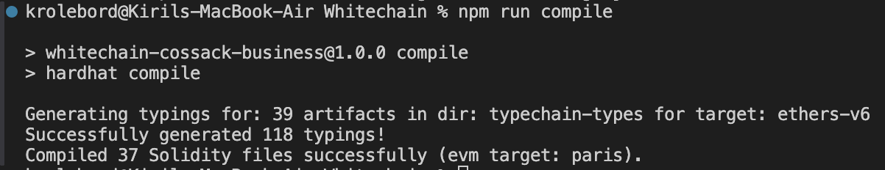
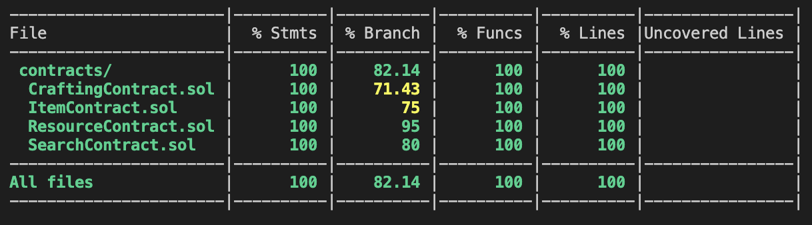
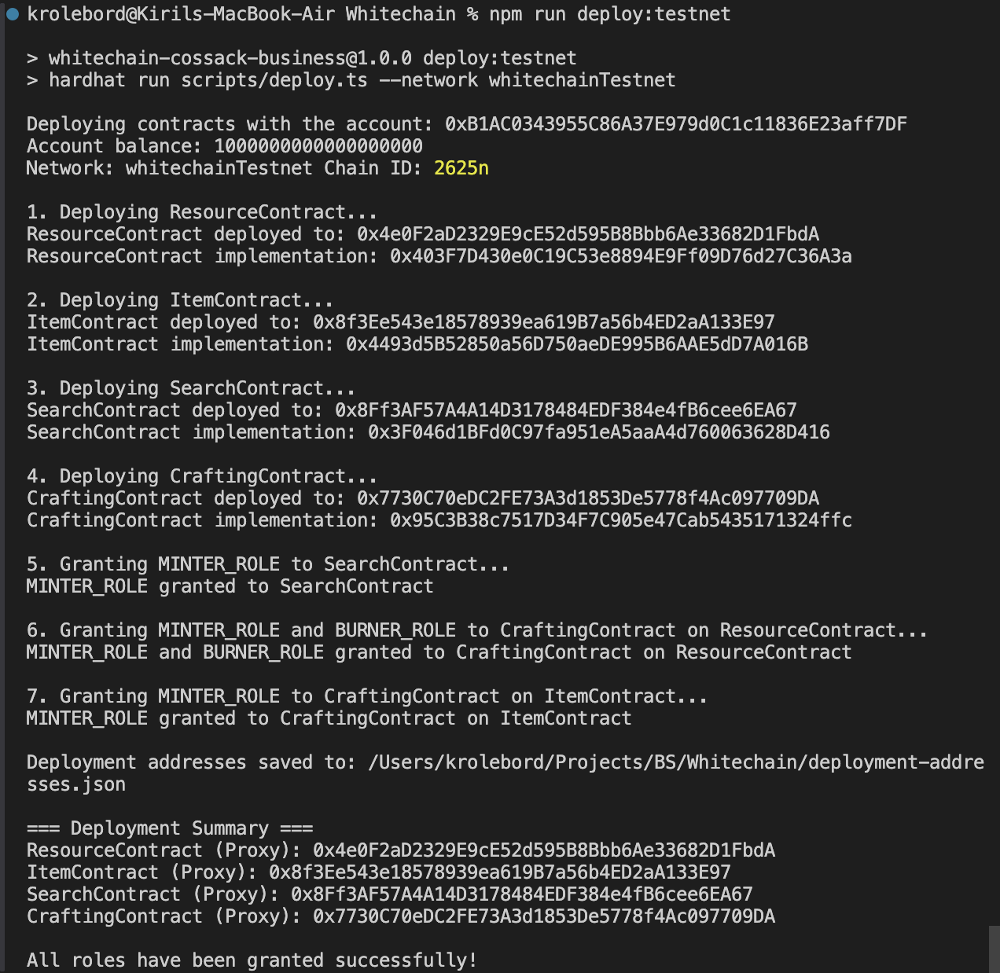

# Cossack Business Game - Whitechain Testnet

## Compile result



## Test

```
> whitechain-cossack-business@1.0.0 test
> hardhat test

  CraftingContract
    Deployment
      ✔ Should deploy with correct initial state (610ms)
      ✔ Should revert if initialized with zero address for resource contract
      ✔ Should revert if initialized with zero address for item contract
    Craft Cossack Saber
      ✔ Should craft Cossack saber with correct resources
      ✔ Should emit ItemCrafted event
      ✔ Should revert if insufficient resources
    Craft Elder's Staff
      ✔ Should craft Elder's staff with correct resources
      ✔ Should revert if insufficient resources
    Craft Character Armor
      ✔ Should craft Character armor with correct resources
    Craft Combat Bracelet
      ✔ Should craft Combat bracelet with correct resources
    Access Control
      ✔ Should allow admin to set contracts (38ms)
      ✔ Should revert if non-admin tries to set contracts
    Upgradeability
      ✔ Should upgrade contract

  Integration Tests
    Complete Game Flow
      ✔ Should allow player to search for resources and craft Cossack saber (112ms)
      ✔ Should allow player to craft multiple items
      ✔ Should prevent crafting without sufficient resources
      ✔ Should allow multiple players to search and craft independently

  ItemContract
    Deployment
      ✔ Should deploy with correct initial state
      ✔ Should have correct item constants
    Access Control
      ✔ Should grant MINTER_ROLE
      ✔ Should revert if non-admin tries to grant role
    Minting
      ✔ Should mint items with MINTER_ROLE
      ✔ Should emit ItemMinted event
      ✔ Should revert if caller doesn't have MINTER_ROLE
      ✔ Should revert if item ID is invalid (0)
      ✔ Should revert if item ID is invalid (>4)
      ✔ Should revert if minting to zero address
      ✔ Should mint multiple items with sequential token IDs
      ✔ Should track item types correctly
    Validation
      ✔ Should validate item IDs correctly
    Interface Support
      ✔ Should support ERC721 interface
      ✔ Should support AccessControl interface
      ✔ Should not support invalid interface
    Upgradeability
      ✔ Should upgrade contract

  ResourceContract
    Deployment
      ✔ Should deploy with correct initial state
      ✔ Should have correct resource constants
    Access Control
      ✔ Should grant MINTER_ROLE
      ✔ Should grant BURNER_ROLE
      ✔ Should revert if non-admin tries to grant role
    Minting
      ✔ Should mint resources with MINTER_ROLE
      ✔ Should emit ResourceMinted event
      ✔ Should revert if caller doesn't have MINTER_ROLE
      ✔ Should revert if resource ID is invalid (0)
      ✔ Should revert if resource ID is invalid (>6)
      ✔ Should revert if minting to zero address
      ✔ Should revert if amount is zero
      ✔ Should mint multiple resource types
    Burning
      ✔ Should burn resources with BURNER_ROLE
      ✔ Should emit ResourceBurned event
      ✔ Should revert if caller doesn't have BURNER_ROLE
      ✔ Should revert if resource ID is invalid
      ✔ Should revert if burning from zero address
      ✔ Should revert if amount is zero
    Validation
      ✔ Should validate resource IDs correctly
    Interface Support
      ✔ Should support ERC1155 interface
      ✔ Should support AccessControl interface
      ✔ Should not support invalid interface
    Upgradeability
      ✔ Should upgrade contract
      ✔ Should revert if non-admin tries to upgrade

  SearchContract
    Deployment
      ✔ Should deploy with correct initial state
      ✔ Should revert if initialized with zero address
    Search Functionality
      ✔ Should mint a random resource when searching
      ✔ Should emit ResourceFound event
      ✔ Should mint exactly 1 resource per search
      ✔ Should mint valid resource IDs (1-6)
    Access Control
      ✔ Should allow admin to set resource contract
      ✔ Should revert if non-admin tries to set resource contract
      ✔ Should revert if setting resource contract to zero address
    Upgradeability
      ✔ Should upgrade contract


  69 passing (1s)
```

## Coverage



## Deployment



[Example contract verification](https://testnet.whitechain.io/address/0x4e0F2aD2329E9cE52d595B8Bbb6Ae33682D1FbdA/contract)

